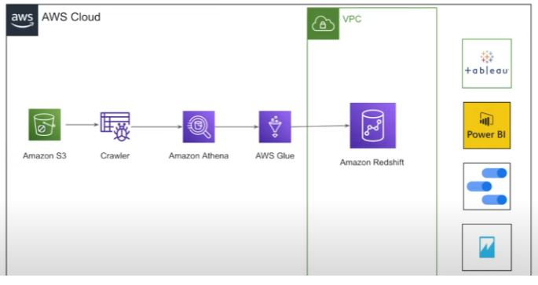
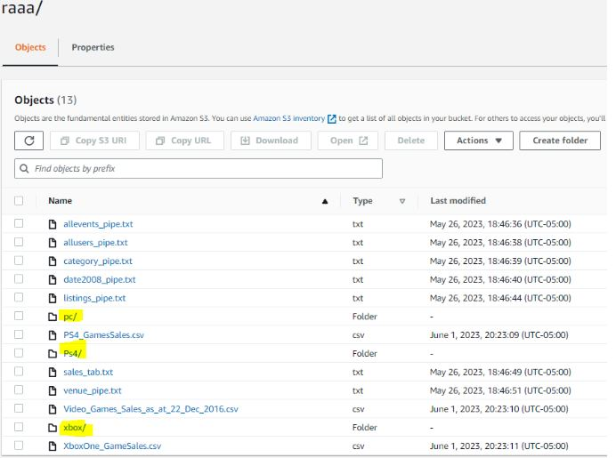
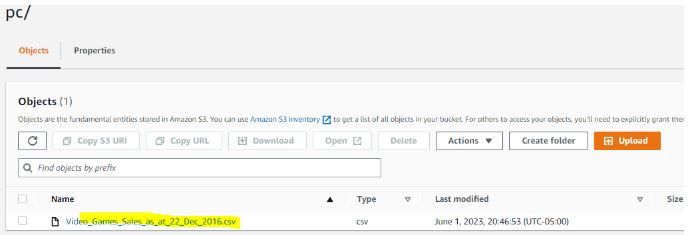
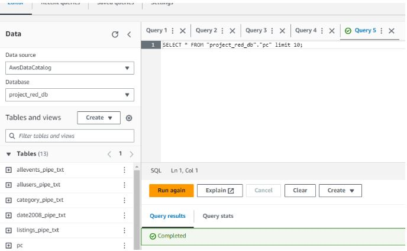
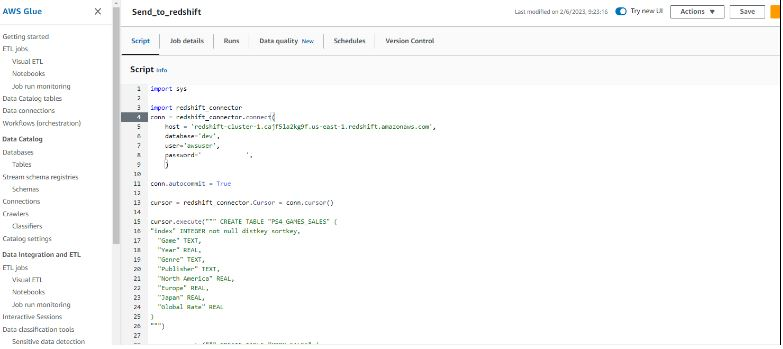
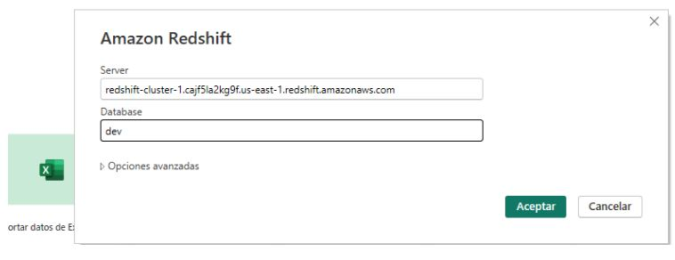
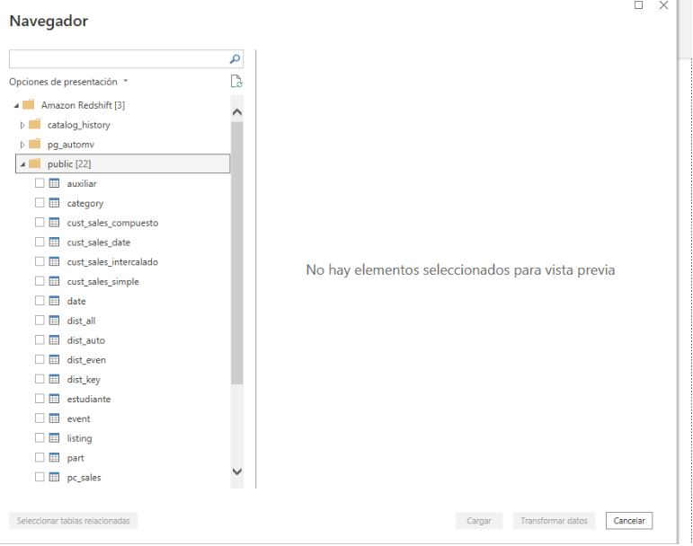

# Data_pipeline_redshift
A simple DataPipeline that goes through the process of uplaoding data to s3, crawling with Glue, Querying with Athena, Transformin using Python, uploading the data to Redshift using Glue, and finally connecting Redshift with Power¨Bi to make a Dashboard

Se suben los archivos (dataset) a un bucket s3. 
Upload the files to a S3 bucket.

Se aplica el Crawler a los folders para que se pueda leer la data dentor de los csv's
We use a Crawler to read the csv's data with Athena.

Terminado el crawling usamos Amazon Athena para verificar que los archivos existan. Luego procedemos a crear un código en Python para hace una transformación de data.
Query the data using Athena to check if the files have data. Then we proceed to create a Python code to Transform the data. (the Amazon_Redshift_Ghby.ipnyb file).

Luego se carga la data transformada a un Bucket S3 para posteriormente usar Amazon Glue y crear el procedimiento en un Python shell para llevar la data a Amazon Redshift.
Then we load the transformed data into a S3 to then use a job on Amazon Glue and create the procedure in a Python Shell to send the data to Amazon Redshift.

Corremos una query simple en Beaver que está conectado a Redshift para verificar la carga de datos. (tambien se puede hacer en Redshift Query Editor).
I ran a query on Beaver that's connected to Redshift to verify that the data loaded properly. (we cna also use Redshift Query Editor).

Enviamos la data desde Redshift a Powerbi usando DirectQuery para porceder a hacer un Análisis de Datos junto con un dashboard en Pbi.
I sent the data from Redshift to Powerbi using DirectQuery to make a dashboard with the data.

Las tablas cargadas a través de Glue fueron las de ventas de PS4, Xbox y Pc.

Procedemos a crear un Dashboard.

Dashboards:
  PS4:
  

  XBOX:
  
  
  MOBILE::
  
  The PC are actually Mobile Games.

